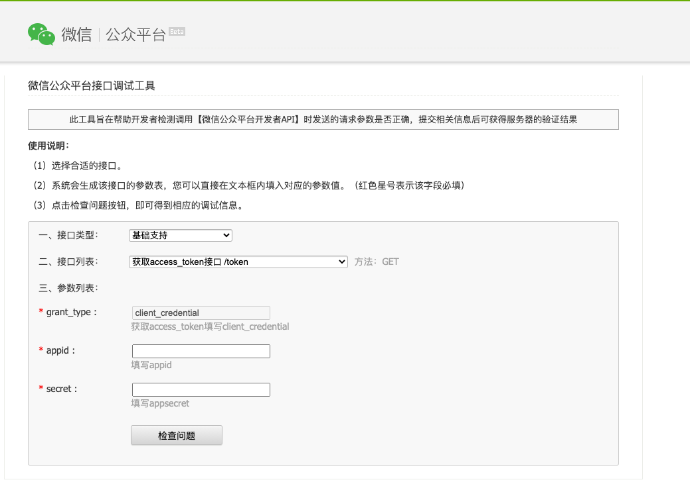
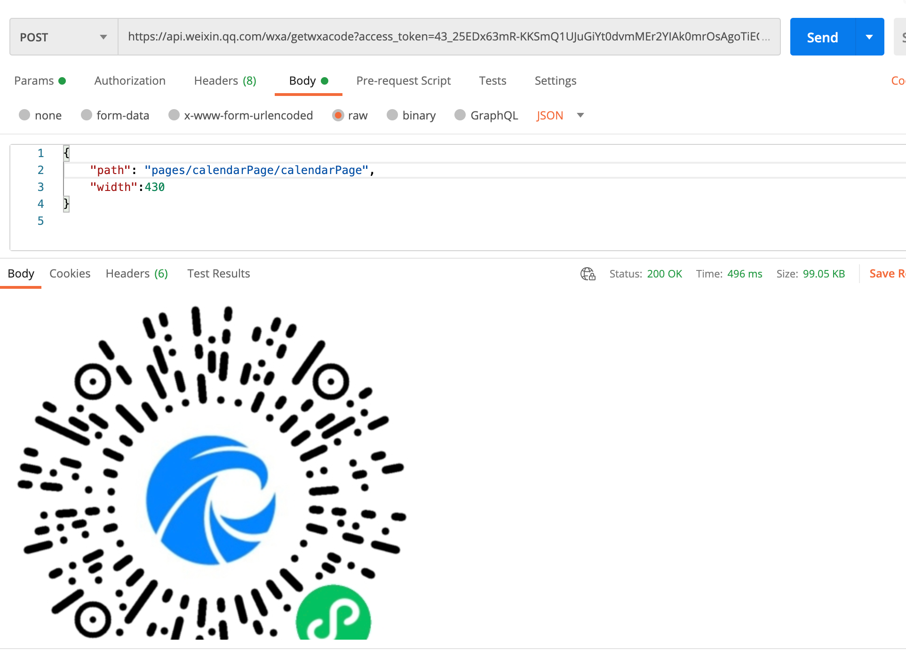

# 微信小程序生成菊花码

这是一个典型的业务场景。其实也没什么难度，只是由于首次接触才显得不明白。

这里做一个梳理，再有需求可直接在这里查字典用即可。

## 步骤

### 1。 获取access_token

```
获取appid和AppSecret，换取access_token。换取链接：https://mp.weixin.qq.com/debug/
```


### 2.根据token 换取菊花码即可

```
https://api.weixin.qq.com/wxa/getwxacode?access_token=ACCESS_TOKEN
```




